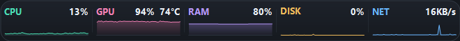
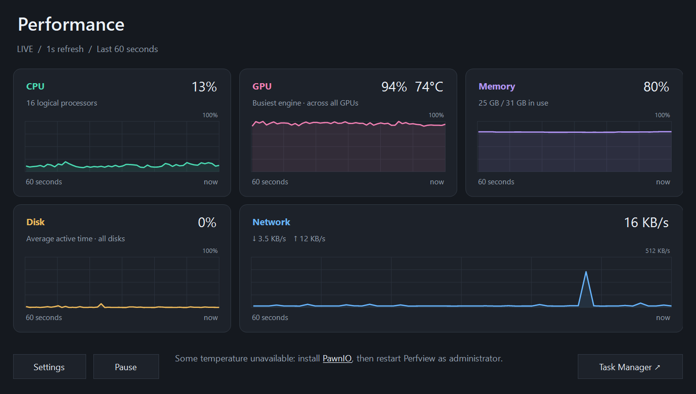
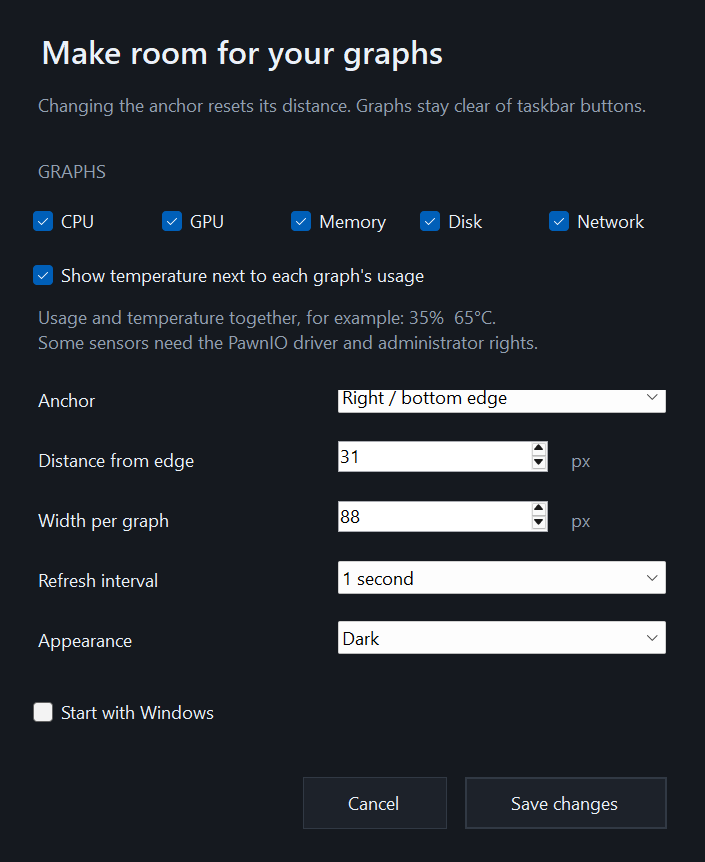

# Perfview

A small, native Windows 10/11 (64-bit) app that puts live performance graphs in your taskbar. Keep an eye on CPU, GPU, memory, disk activity, and network throughput at a glance.

## Features

- Live graphs for CPU, GPU, memory, disk, and network, with separate download/upload rates in the details view.
- Draggable taskbar strip that adapts to available space and stays clear of taskbar buttons.
- Choose which graphs to show, their width, position, and refresh interval.
- Optional component temperatures next to the usage values in the existing taskbar and detail graphs.
- System, light, and dark themes, plus pause/resume and optional start with Windows.
- All data stays on your machine. No telemetry or Explorer modifications. Ordinary performance graphs work without administrator rights.

## Screenshots

**Taskbar graphs**



**Performance details**



**Settings**




## Install Perfview

Perfview requires Windows 10 or 11, 64-bit, and .NET Framework 4.8 or later. If the runtime is missing, install [.NET Framework 4.8](https://dotnet.microsoft.com/download/dotnet-framework/net48) before you continue.

### Use the installer

1. Open the [releases page](https://github.com/NeevCohen/perfview/releases) and download `Perfview-<version>-Setup.exe` from the release assets.
2. Exit Perfview if it is running, then run the installer.
3. Follow the setup wizard and launch Perfview from the final page or the Start menu.

By default, the installer installs Perfview for your Windows account in `%LOCALAPPDATA%\Programs\Perfview` without administrator rights. It creates a Start menu shortcut and offers an optional desktop shortcut. To uninstall Perfview, use Windows Settings > Apps.

### Use the portable app

1. Download `Perfview-<version>-Windows-Portable.zip` from the [releases page](https://github.com/NeevCohen/perfview/releases).
2. Extract the entire archive to a folder of your choice.
3. Run `Perfview.exe` from that folder.

Keep `Perfview.exe.config`, all DLLs, and `THIRD-PARTY-NOTICES.txt` alongside `Perfview.exe`. To start Perfview when you sign in, enable **Start with Windows** in Settings.

## Build from source

Build on Windows 10 or 11, 64-bit, with .NET Framework 4.8 or later and the [.NET SDK](https://dotnet.microsoft.com/download). CI uses the .NET 10 SDK. The SDK is required to build Perfview; the installed app uses .NET Framework 4.8.

Clone the repository with Git, then open its directory in PowerShell:

```powershell
git clone https://github.com/NeevCohen/perfview.git
cd perfview
```

Exit any running development copy of Perfview, then build:

```powershell
.\build.ps1
```

The script restores the pinned NuGet dependencies and writes a Release build to `bin\`. The first build needs internet access to download dependencies. Launch the app with:

```powershell
.\bin\Perfview.exe
```

To build and run the app tests:

```powershell
.\build.ps1 -Test
```

See [Contributing](CONTRIBUTING.md#building-and-testing) for test filters when live performance counters or an interactive desktop are unavailable.

### Build the installer

From the repository root, run:

```powershell
.\build-installer.ps1 -Bootstrap
```

The script builds the app and packages it with Inno Setup. If a compiler is not found, `-Bootstrap` downloads and verifies Inno Setup 6.7.3, then extracts a portable copy under `artifacts\tools\`. If Inno Setup 6 or 7 is already installed, you can omit `-Bootstrap`. To select a compiler explicitly, pass `-InnoCompiler 'C:\path\to\ISCC.exe'`.

The installer and its `.sha256` checksum are written to `artifacts\installer\Perfview-<version>-Setup.exe` and `artifacts\installer\Perfview-<version>-Setup.exe.sha256`. Run the generated installer to install your build. Add `-Test` to run the app tests and installer install, upgrade, and uninstall tests.

## Temperatures

Enable **Show temperature next to each graph's usage** in Settings. The existing CPU, GPU, memory, disk, and network graphs show usage and temperature together, such as **35%  65°C**. The charts continue to show utilization or throughput. No extra graph or separate temperature view is added.

Temperature monitoring uses the bundled [LibreHardwareMonitor library](https://github.com/LibreHardwareMonitor/LibreHardwareMonitor). Readings are matched to their component, including sensors on subdevices. CPU package, GPU core, and drive composite temperatures are preferred; if multiple devices share a graph, it shows the highest available device temperature for that component. Availability depends on hardware and drivers. Unavailable temperatures are hidden, leaving only the usage reading; this is common for memory and network adapters. CPU and some other sensors require the separately installed [PawnIO driver](https://github.com/namazso/PawnIO) and administrator access. Performance details explain missing access and link to the driver; after installing it, exit Perfview and run it as administrator. Perfview does not install drivers automatically. Ordinary performance monitoring works without administrator rights. Temperature monitoring is off by default.
